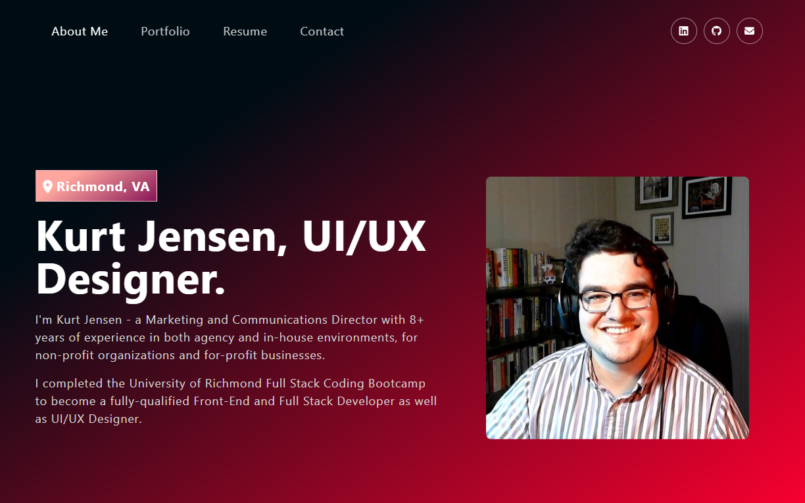

# React Portfolio

## Description

My portfolio - highlights from my work during the University of Richmond Full Stack Coding Bootcamp, deployed to GitHub pages, built with React.

## Deployed Screenshot & Link

Deployed at: [https://kurtmj93.github.io/react-portfolio/](https://kurtmj93.github.io/react-portfolio/)

## Credits

  - Heavily influenced by webdecoded on YouTube: see [webdecoded React Project Tutorial](https://www.youtube.com/watch?v=hYv6BM2fWd8) and the relevant [GitHub Repo](https://github.com/judygab/web-dev-projects/tree/main/personal-portfolio).
  - University of Richmond Full Stack Coding Bootcamp
  - This project was bootstrapped with [Create React App](https://github.com/facebook/create-react-app).

## Questions

  - [GitHub User: Kurtmj93](https://github.com/Kurtmj93/)
  - Email: kurtmj93@gmail.com
